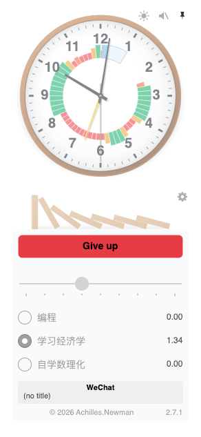
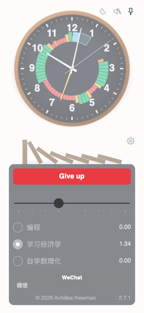
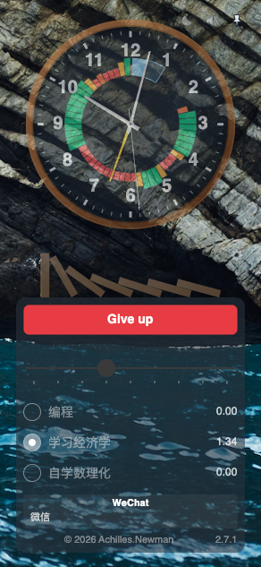
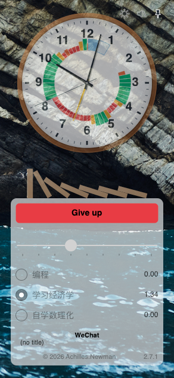
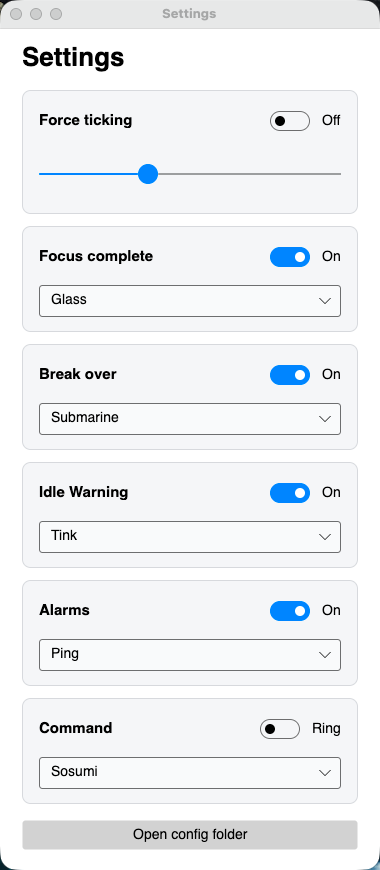
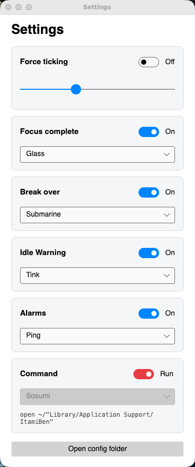

# ItamiBen — 痛みを知らせる

> **痛みを知らせる** — it lets you know it hurts.

A pomodoro clock with teeth. Declare what counts as work, commit to a stretch of focus,
and it watches your foreground window the whole time. Open anything else, wander off to
get water — those minutes don't count, and the break slides further away while you watch.

No popups, no nagging, no congratulations. Just a clock too dumb to negotiate.

[中文说明](./README_ZH.md)

## Screenshots

| Light | Dark |
| ----- | ---- |
|  |  |

| Transparent | Transparent |
| ----------- | ----------- |
|  |  |

| Settings | Settings, command example |
| -------- | ------------------------- |
|  |  |

## Install

**macOS** — download `ItamiBen-<version>-macOS-<arch>.dmg` from
[Releases](https://github.com/Achillesy/CSharp_ItamiBen/releases), open it, drag into
Applications.

**Windows 11** — download `ItamiBen-<version>-win-x64.exe` from
[Releases](https://github.com/Achillesy/CSharp_ItamiBen/releases) and run the installer.

**Ubuntu 24.04** — download `ItamiBen_<version>_Ubuntu_amd64.deb` (Intel/AMD) or
`ItamiBen_<version>_Ubuntu_arm64.deb` (ARM — e.g. an Ubuntu 24.04 VM on an Apple Silicon Mac),
then:

```bash
sudo apt install ./ItamiBen_2.7.1_Ubuntu_arm64.deb   # or _amd64, whichever matches your machine
ItamiBen
```

The .deb is framework-dependent, like the other two builds: `apt` pulls in
`dotnet-runtime-10.0` from Ubuntu's own archive automatically — no SDK, no extra
package feed, no manual setup.

All three builds are framework-dependent — they need the .NET 10 Runtime installed.
Windows wants the Desktop Runtime; its installer detects a missing one and offers to
install it for you. (On WSL, the app needs WSLg for the window to show.)

## How a round works

1. Pick one goal, drag the slider (10–50 minutes), press **Start**.
2. A second counts only if the window you're actually looking at matches a rule you wrote
   **before** the run — never during it.
3. Off-task, idle, and locked-screen seconds all eat the same fixed budget. When it's gone,
   the round ends. There is no way to earn it back.

ItamiBen gets no special treatment either: staring at its own dial counts as off-task,
exactly like anything else.

## Configuring it: hand a file to an AI

After installing, open **Settings → Open config folder** — no need to hunt down any path
yourself. Everything lives in four Markdown files:

| file | decides |
|---|---|
| `rules.md` | what counts as work |
| `commands.md` | what this machine may be made to run |
| `schedule.md` | recurring reminders, in crontab format |
| `layout.md` | window size and transparency |

Each file explains itself — to you, and to an AI. **Give one whole file to any AI, say what
you want, replace the file with what comes back.** That's the entire configuration story:
nothing to install, nothing to memorize.

(If you ever need the paths by hand: macOS `~/Library/Application Support/ItamiBen/`,
Windows `%LOCALAPPDATA%\ItamiBen\`.)

## For developers

```bash
dotnet build ItamiBen.slnx
dotnet test  ItamiBen.slnx
./run-macos.sh              # build → .app → sign → launch
```

The `dotnet` commands are the same on macOS, Windows, and Linux (with the .NET 10 SDK
installed).

## Releases

```bash
./pack-macos.sh                # → dist/ItamiBen-<version>-macOS-<arch>.dmg
.\pack-windows.ps1             # → dist\ItamiBen-<version>-win-x64.exe (needs Inno Setup 6)
./pack-ubuntu.sh [amd64|arm64] # → dist/ItamiBen-<version>_Ubuntu_<arch>.deb (defaults to host arch)
```

All three package the same framework-dependent publish (`-r <rid> --self-contained
false`, .pdb files stripped by the csproj) — the Ubuntu one just wraps it in a .deb
whose `Depends` pulls `dotnet-runtime-10.0` from Ubuntu's archive. If you build the
Ubuntu package yourself, install it with the command above and report back how it went.

## Platform status

| platform | status |
|---|---|
| macOS | ✅ verified end to end |
| Windows 11 | ✅ verified end to end (2026-09-18) |
| Ubuntu 24.04 | ✅ installable .deb (amd64/arm64), verified installing on 24.04; focus judging works under X11 (2026-09-26) |

## Name

**Itami** (痛み) is pain. **Ben** is Big Ben — punctual, loud, impossible to negotiate with.

## Sponsor

ItamiBen is free for noncommercial use, and always will be. If it keeps you honest, consider buying me a coffee:

- ☕ [Ko-fi](https://ko-fi.com/achillesy) (international, via PayPal)

Sponsorship is entirely voluntary and doesn't affect any features.

## License

[PolyForm Noncommercial License 1.0.0](./LICENSE) — free for noncommercial use.

Copyright (c) 2026 Achilles.Newman (https://github.com/Achillesy)
